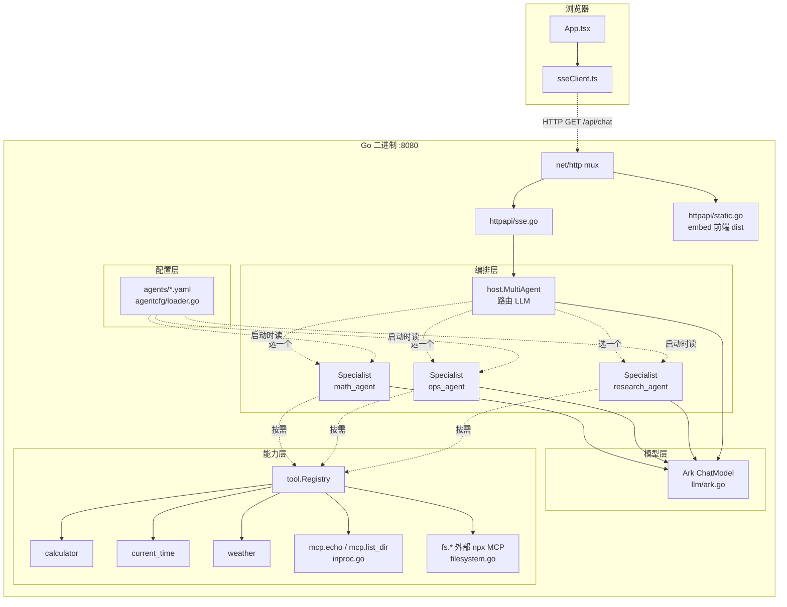
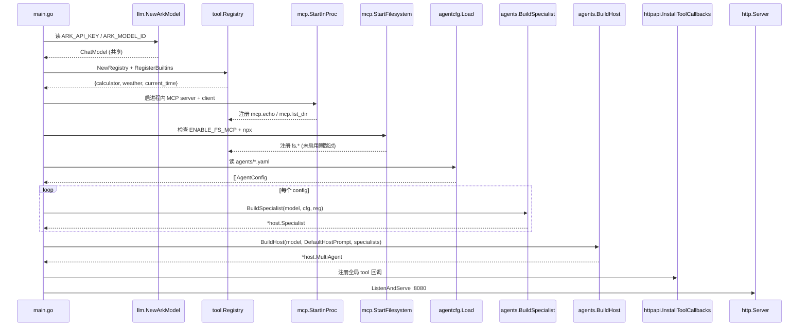
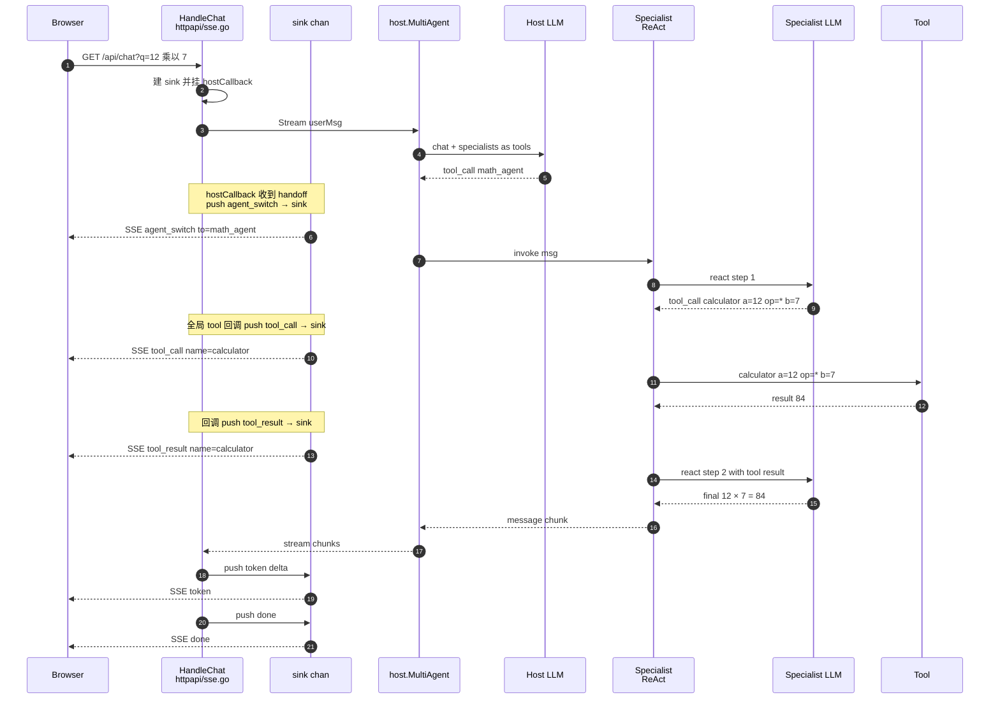
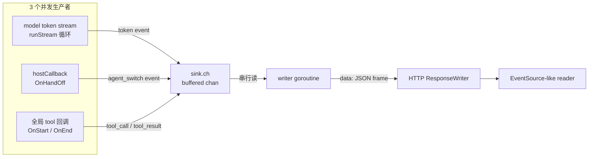

# 架构指南 — first-agentInK8s

> 面向"我要在这个骨架上扩展新能力"的教科书。
> 每一节都：先解释**是什么**，再讨论**为什么这样设计**，然后给**代码坐标（`file:line`）**，最后一个**最小示例或调用链**。
> 与 `STATUS.md` 分工：那份是"当前状态 + 决策日志"，本文件是"架构原理"。代码变了就来更新对应小节的引用。

**当前 commit：** `54be7be`（2026-07-15）
**目标读者：** 项目作者本人；假设读者会 Go / TS 语法，但对 Eino / MCP / 多 agent 编排是新手。

---

## 目录

1. [一分钟视角：这个 demo 究竟在演示什么](#1-一分钟视角)
2. [四张核心图](#2-四张核心图)
3. [启动顺序：`main.go` 逐步拆解](#3-启动顺序)
4. [LLM 抽象：把 Ark 装进 Eino 的插座](#4-llm-抽象)
5. [Tool Registry：所有能力的中央黄页](#5-tool-registry)
6. [MCP 集成：两种连接模式](#6-mcp-集成)
7. [Agent 编排：Host + Specialist 的分工](#7-agent-编排)
8. [SSE 传输：三个生产者，一个 sink](#8-sse-传输)
9. [Web 前端：SSE → chip → UI](#9-web-前端)
10. [YAML 声明面：扩展一个新 agent 需要改什么](#10-yaml-声明面)
11. [部署路径：从 `main.go` 到 pod](#11-部署路径)
12. [设计模式速查表](#12-设计模式速查表)
13. [下一步扩展方向的着力点](#13-下一步扩展方向的着力点)

---

## 1. 一分钟视角

这是一个 **"用户一句话 → host LLM 判断路由 → 挑一个 specialist → specialist 用自己的工具集完成 → 结果流式回吐"** 的多 agent 骨架。

**核心抽象四层：**

| 层次 | 对应组件 | 一句话 |
|---|---|---|
| **传输** | HTTP + SSE | 浏览器和后端流式对话的通道 |
| **编排** | Eino `host.MultiAgent` | 一个 host LLM + 多个 specialist LLM 的"经理-下属"关系 |
| **专家** | Eino `react.Agent` | 一个 specialist = 一个 ReAct 循环（think → tool → think → …）|
| **能力** | `tool.BaseTool` | 所有可调用能力的统一接口（内置 Go 函数 / MCP tool 都实现它）|

**它演示了但没深入实现的：** RAG、长期记忆、反问澄清、评估 —— 都是留白，等你去填。

**它已经决定的重要约束：**

- 所有 agent（host + specialist）**共享同一个 Ark ChatModel**。想让 math agent 用便宜模型、host 用强模型？现在的骨架不支持，得改 `llm.NewArkModel` 让它支持 per-agent 覆盖。
- Specialist 由 YAML 声明，**但工具还是 Go 代码里注册的**。想加一个新 tool，YAML 引用它前必须先在 `tools.RegisterBuiltins` 或某个 MCP 服务里注册。
- host 路由 prompt 是**代码常量**（`agents.DefaultHostPrompt`），不是 YAML —— 因为"一个经理 vs 一群下属"这个 topology 是骨架的核心契约，改它意味着改设计而不是配置。

---

## 2. 四张核心图

### 2.1 组件依赖图 — 谁调用谁



### 2.2 启动顺序图



### 2.3 一次请求完整调用链



### 2.4 数据流 — SSE 事件的三个来源



**要点：** 三个源头都往同一个 `sink` 塞 event，sink 是 `chan Event`（buffer=64），只有一个 writer goroutine 消费并往 HTTP 流写。这样保证 **event 顺序** 但生产者不会互相阻塞（除非缓冲满，那时会丢事件而不是阻塞模型循环）。

---

## 3. 启动顺序

**文件：** [`cmd/server/main.go`](cmd/server/main.go)

`main.go` 顶部注释已经把八步启动清楚写下（`main.go:1-14`）。这里补充**每一步为什么这个顺序不能乱**：

### 步骤 1：Ark ChatModel（`main.go:47-51`）

**为什么第一步：** 环境变量 `ARK_API_KEY` / `ARK_MODEL_ID` 缺失就 `log.Fatalf` —— **fail fast**。否则可能启动到第 6 步组装 specialist 时才发现连不上模型，白干前面 5 步。

**共享一份还是每个 agent 一份：** 现在是共享一份（`main.go:48` 只调一次 `llm.NewArkModel`），传给所有 specialist 和 host。这是简化的假设 —— 见 [§4](#4-llm-抽象) 讨论。

### 步骤 2：Tool Registry + Builtins（`main.go:53-57`）

**为什么先于 MCP：** 内置 tool 是"必成功"的（Go 代码里的纯函数），MCP 是"warn-and-continue"的。先把稳的能力放好，MCP 挂了不至于连基础都没有。

### 步骤 3：MCP Sources（`main.go:59-71`）

**为什么两个都是 warn-and-continue：** 一旦要求所有 MCP 都成功，容器里没 `npx` 就启动失败 —— 部署要么塞 node（镜像大一倍）、要么改代码。现在设计：外部 MCP 失败就跳过，Registry 里就没 `fs.*` 那些名字，Specialist 引用它们时按"可选"处理（见 `tools.MustResolve` 对 `fs.` 前缀的特殊逻辑，`registry.go:69-90`）。

**这个设计的代价：** 你在 YAML 里手抖把 `weather` 拼成 `wether`，跟真外部 MCP 失败一样是运行时报错 —— 但 `weather` 不带 `fs.` 前缀所以是硬错，会 `log.Fatalf`。所以 **`fs.` 前缀是唯一的"魔法命名空间"**（`registry.go:77`）。想放宽这个约束，得把"可选性"从名字前缀提到 YAML 字段级。

### 步骤 4：Agent 配置加载（`main.go:73-78`）

**关键点：** `agentcfg.Load` 读 `agents/*.yaml`，**按文件名字典序**（`loader.go:31-41`）加载，检查 name 重复（`loader.go:44-53`）。字典序保证启动日志和 host 内 specialist 列表顺序稳定，便于 debug。

### 步骤 5：Specialists 构造（`main.go:80-89`）

**每个 config → 一个 `host.Specialist`。** 里面藏着 ReAct 循环 —— 见 [§7.2](#72-specialist-的构造)。

### 步骤 6：Host MultiAgent（`main.go:91-95`）

**至少要一个 specialist**（`build.go:87`），否则报错 —— 一个"经理没下属"的 topology 没意义。

### 步骤 7：全局 Tool 回调（`main.go:97-98`）

**为什么在 HTTP 之前：** 回调是通过 `callbacks.AppendGlobalHandlers` 装到全局的（`sse.go:109`），必须在第一次请求进来前挂好。放在 HTTP listen 之后就有竞态。

### 步骤 8：HTTP 服务器（`main.go:100-123`）

三个路由：`/healthz`（k8s probe）、`/api/chat`（SSE 主入口）、`/`（embed 前端 SPA fallback）。

### 优雅关闭（`main.go:125-136`）

`signal.NotifyContext` 捕获 SIGINT/SIGTERM，10s 超时 shutdown HTTP，再关闭所有 MCP client（外部 MCP 的 stdio 子进程也一并回收）。

---

## 4. LLM 抽象

**文件：** [`internal/llm/ark.go`](internal/llm/ark.go)

### 是什么

`llm.NewArkModel` 从环境变量读配置，返回一个 `model.ToolCallingChatModel`（Eino 的接口）。所有需要 LLM 的地方都用这个接口，不直接依赖 Ark SDK。

```go
func NewArkModel(ctx context.Context) (model.ToolCallingChatModel, error)
```

### 为什么这样设计

**"单点构造 + 接口暴露"** 有两个好处：

1. **fail fast**：`ARK_API_KEY` / `ARK_MODEL_ID` 检查在 `main` 第一步就做（`ark.go:32-34`）；不然可能启动到第 6 步才炸。
2. **抽象隔离**：`agents/build.go` 只见到 `einomodel.ToolCallingChatModel`（`build.go:17`），不见 Ark SDK。**想换成 OpenAI / Doubao / Anthropic**，改这一个文件就行 —— 只要新 SDK 有 Eino 适配器（`eino-ext/components/model/openai` 之类）。

### 当前的局限

**所有 agent 共享同一个 ChatModel 实例**（`main.go:48`）。这意味着：

- ✅ 简单，一次配置到处生效
- ❌ 无法让 host 用强模型（如 doubao-pro）、specialist 用便宜模型（如 doubao-lite）
- ❌ 无法让某个 agent 用不同 temperature / top_p

**想解决：** 把 `NewArkModel` 改成 `NewArkModelFor(cfg AgentModelConfig)`，YAML 里加 `model:` / `temperature:` 字段，Build 阶段每个 specialist 拿自己的 model 实例。参见 [§13](#13-下一步扩展方向的着力点) 的"per-agent 模型"条。

---

## 5. Tool Registry

**文件：** [`internal/tools/registry.go`](internal/tools/registry.go)

### 是什么

一个 `map[string]tool.BaseTool` + 读写锁，加上批量解析函数 `MustResolve`。

```go
type Registry struct { m map[string]tool.BaseTool; ... }
func (r *Registry) Register(name string, t tool.BaseTool) error
func (r *Registry) MustResolve(names []string) ([]tool.BaseTool, error)
```

### 为什么这样设计

**核心问题：** YAML 配置文件里的 `tools: [calculator, weather]` 只是字符串，最终 ReAct agent 需要真正的 `tool.BaseTool` 实例才能调用。中间需要一层"字符串 → 实例"的映射 —— 那就是 Registry。

**三个非显然的设计选择：**

#### 5.1 `fs.` 前缀的"可选性魔法"

`MustResolve` 里对 `fs.` 前缀特殊处理：找不到就 warn + skip，不是硬错（`registry.go:77-81`）：

```go
if strings.HasPrefix(n, "fs.") {
    log.Printf("tools: optional tool %q not registered ...")
    continue
}
```

**为什么在名字里而不是 YAML 字段：** 简单 —— 不用给 YAML schema 加复杂的"是否必选"配置。**代价：** 对新贡献者不明显，需要文档或注释。

#### 5.2 一次注册全局共享

`RegisterBuiltins` 在启动时一次性注册（`registry.go:102-120`）。同一个 tool 实例被多个 specialist 共享。**这是安全的**，因为：

- Tool 实现应该是**无状态**的（`calculator` 是纯函数，`current_time` 只调 `time.Now()`，`weather` 只读 canned map）
- 有状态的 tool（比如带连接池的数据库 tool）需要自己做并发安全

#### 5.3 Registry 的接口 shape

只有 `Register` / `Get` / `MustResolve` / `Names`，**没有 `Unregister` / `Reload`**。这是刻意的：目前所有 tool 在启动时静态注册，运行时不变。**想动态加 tool**（比如 hot-reload YAML、按会话给不同 agent 装不同 tool），需要扩展 Registry API。

### 内置 tool 的写法示例

**`calculator.go`**（21 行）演示了 Eino 内置 tool 的最简写法 —— 用 `utils.InferTool` 从 Go 函数签名自动生成 JSON schema：

```go
type CalcInput struct {
    A  float64 `json:"a"  jsonschema:"description=first operand"`
    Op string  `json:"op" jsonschema:"description=one of + - * /,enum=+,enum=-,enum=*,enum=/"`
    B  float64 `json:"b"  jsonschema:"description=second operand"`
}
func newCalculatorTool() (tool.BaseTool, error) {
    return utils.InferTool(
        "calculator",
        "Perform a single arithmetic operation...",  // ← LLM 看到的 description
        func(ctx context.Context, in *CalcInput) (*CalcOutput, error) { ... },
    )
}
```

**关键：`jsonschema` 结构 tag** —— Eino 用 `github.com/eino-contrib/jsonschema` 生成 OpenAI-style function schema 交给 LLM。`enum=+,enum=-,enum=*,enum=/` 会变成 `"enum": ["+", "-", "*", "/"]`，LLM 只会传合法值。

**同类：** `time.go`（timezone-aware 时间）、`weather.go`（stub map，演示"外部 API 但可离线"的形态）。

---

## 6. MCP 集成

**目录：** [`internal/mcp/`](internal/mcp/)

MCP（Model Context Protocol）是 Anthropic 提的一套"LLM ↔ 外部工具"通信协议。此项目集成了两种 MCP 部署形态。

### 6.1 In-process MCP（`internal/mcp/inproc.go`）

**是什么：** 在同一个 Go 进程里跑一个 MCP server 和 MCP client，让它们通过内存 pipe 通信。注册的工具带 `mcp.` 前缀（`mcp.echo` / `mcp.list_dir`）。

**为什么这么做：**

- **零外部依赖** —— 容器里不需要 node、不需要 python，走 Go 内部 pipe
- **验证协议兼容性** —— 你写的 Go tool 若照 MCP schema 定义，切换到"外部 MCP server 用 Go 重写"是无缝的
- **"in-proc client + real MCP server"** 是主流 MCP 客户端库（`mark3labs/mcp-go`）内建支持的模式，代码几乎不用改

**代码脉络（`inproc.go:29-98`）：**

```go
srv := mcpserver.NewMCPServer("demo-inproc", "0.1.0")
srv.AddTool(mcpproto.NewTool("echo", ...), handler)  // 定义
cli, _ := mcpclient.NewInProcessClient(srv)           // in-proc pipe
cli.Initialize(ctx, initReq)                          // MCP 握手
list, _ := einomcp.GetTools(ctx, &einomcp.Config{Cli: cli})  // 变 Eino tool
for _, t := range list { reg.Register("mcp."+info.Name, t) }  // 加前缀注册
```

### 6.2 External MCP over stdio（`internal/mcp/filesystem.go`）

**是什么：** 起一个 `npx -y @modelcontextprotocol/server-filesystem` 子进程，通过 stdio 交互。注册的工具带 `fs.` 前缀。

**门槛（`filesystem.go:34-55`）：**

- 环境变量 `ENABLE_FS_MCP=1` 才开启（默认关）
- 需要 `npx` 在 PATH 上（Windows 上 `LookPath` 会正确处理 `.cmd` 后缀）
- 需要 `FS_MCP_ROOT` 环境变量指定一个可访问目录（缺失就 fallback 到当前工作目录）

**为什么这么谨慎：** 见 `filesystem.go:23-25` 注释 —— 生产环境的 distroless 镜像没有 node，所有失败都 warn-and-continue，返回 `(nil, nil)`。**这是当前"本地能跑、k8s 里 filesystem MCP 没起"的根源**（见 `STATUS.md` 已知问题 §2）。

**代码脉络（`filesystem.go:57-97`）：**

```go
cli, _ := mcpclient.NewStdioMCPClient(npxPath, nil, "-y", "@modelcontextprotocol/server-filesystem", root)
// 30s 初始化超时（防 npx 首次下载卡住）
initCtx, cancel := context.WithTimeout(ctx, 30*time.Second)
cli.Initialize(initCtx, initReq)
list, _ := einomcp.GetTools(ctx, &einomcp.Config{Cli: cli})
for _, t := range list { reg.Register("fs."+info.Name, t) }
```

### 6.3 两种模式的对比

| 维度 | In-process | External (stdio) |
|---|---|---|
| 部署 | 无额外依赖 | 需要目标语言 runtime |
| 性能 | 内存 pipe，几乎零开销 | stdio + JSON-RPC，有序列化开销 |
| 生态 | 你自己写 | 现成的 MCP servers（filesystem、github、slack…）|
| 崩溃隔离 | 挂了拖 Go 进程一起挂 | 子进程崩了不影响主进程 |
| 演示价值 | 证明 Eino MCP 集成能工作 | 证明能接入生态里现成的服务 |

**扩展空间：** 未来若接 SSE 或 WebSocket 的远程 MCP server（比如 `mcp-server-github` 部署成独立服务），同一个 Registry + Eino `GetTools` 模式还能复用，只是 client 构造方式换成 `NewHTTPMCPClient` 之类。

---

## 7. Agent 编排

**文件：** [`internal/agents/build.go`](internal/agents/build.go)

这是项目最"密"的一节 —— 20 行代码承载了整个多 agent 拓扑。

### 7.1 Host + Specialist 模式（"handoff as tool call"）

**核心思想：** Host 是一个 LLM，它看到的"工具"不是 calculator 这种，而是**每个 specialist**。当用户来了消息，host LLM 决定"调用"哪个 specialist —— 这个"tool call" 在 Eino 内部触发 handoff。Eino 随后运行 specialist 的 Invokable/Streamable，把结果塞回 host 上下文。

**这个模式的名字：** OpenAI Swarm 起的头，Coze / Eino 沿用。类比：**函数调用式的委托** —— 你不需要单独设计"路由规则"，就用 LLM 已经很擅长的"function calling"来做路由。

**代码骨架：**

```go
func BuildHost(ctx, cm, systemPrompt, specialists) (*host.MultiAgent, error) {
    return host.NewMultiAgent(ctx, &host.MultiAgentConfig{
        Host: host.Host{
            ToolCallingModel: cm,        // host 用的 LLM
            SystemPrompt:     systemPrompt,  // ← DefaultHostPrompt
        },
        Specialists: specialists,
        Name:        "router",
    })
}
```

Host 的 system prompt 定义在 `build.go:101-107`：

```
You are the routing agent for a multi-agent system.
You have several specialist sub-agents available as tools. For every user
message, pick the single most appropriate specialist and hand off. ...
```

Specialist 的**关键字段**是 `AgentMeta.IntendedUse`（`build.go:65-66`），它是 YAML 的 `description` —— **host LLM 就是靠读这个字段决定路由的**。这也是为什么 `agentcfg/loader.go:75` 把 description 列为必填字段。

### 7.2 Specialist 的构造

一个 Specialist 就是一个 **ReAct agent**（`build.go:53-58`）：

```go
ra, _ := react.NewAgent(ctx, &react.AgentConfig{
    ToolCallingModel: cm,                                    // 同一个 Ark 模型
    ToolsConfig:      compose.ToolsNodeConfig{Tools: resolved},  // 从 YAML tools 名字解析出的 tool 实例
    MessageModifier:  modifier,                              // 每次 invoke 前注入 system prompt
    MaxStep:          cfg.MaxStep,                           // ReAct 步数上限（默认 12）
})
```

**ReAct 循环**（Eino 内部实现）：

```
1. LLM 看 messages（含 system prompt + user + 已有历史）
2. LLM 决定：要么输出最终答案，要么发起 tool_call
3. 若 tool_call：Eino 执行 tool → 结果 append 到 messages → 回到 1
4. 若最终答案：返回 message
5. 超过 MaxStep 强制停止（防死循环）
```

**MessageModifier**（`build.go:45-51`）：ReAct 每次内部循环都会调这个函数把 messages 转换一遍。此项目用它来**幂等地在最前加 system message** —— 如果外部调用者已经带了 system 就不重复加。

**Specialist 包装**（`build.go:63-74`）：把 `react.Agent` 塞进 `host.Specialist` 结构，主要是把 `Generate` / `Stream` 绑到 `Invokable` / `Streamable` 字段上。Eino host 就靠这两个字段调用 specialist。

### 7.3 Callbacks —— host handoff 是怎么被 SSE 感知的

Host handoff 事件通过 `host.WithAgentCallbacks` 传入（`sse.go:168`）：

```go
sr, err := s.HostMA.Stream(ctx, in, host.WithAgentCallbacks(hostCallback{}))
```

`hostCallback` 实现了 `host.MultiAgentCallback`（`sse.go:71-79`）：

```go
func (hostCallback) OnHandOff(ctx, info *host.HandOffInfo) context.Context {
    if s := sinkFrom(ctx); s != nil {
        s.push(Event{Type: EventAgentSwitch, Data: AgentSwitchData{
            To: info.ToAgentName, Argument: info.Argument,
        }})
    }
    return ctx
}
```

**注意 sink 是通过 `context.Value` 传的**（`sse.go:57-65`）—— 因为 callback 只能拿到 ctx，没有其他通道能把"当前 SSE 请求的 sink"传进去。这是常见的 **"per-request state via context"** 模式。

### 7.4 Tool 调用的 SSE 追踪

Tool 调用不像 handoff 走 `WithAgentCallbacks` —— 它走 **全局回调**（`sse.go:85-110`）：

```go
callbacks.AppendGlobalHandlers(handler)  // 全局注册一次，所有 tool 调用都触发
```

Handler 通过 `sinkFrom(ctx)` 判断当前是否在 SSE 请求上下文里：有 sink 就 push 事件、没就静默。这样"骨架层"的全局回调不会影响非 SSE 场景。

---

## 8. SSE 传输

**文件：** [`internal/httpapi/sse.go`](internal/httpapi/sse.go) + [`internal/httpapi/events.go`](internal/httpapi/events.go)

### 8.1 Event schema（`events.go`）

**6 种事件类型：**

| Type | 何时发 | Data 字段 |
|---|---|---|
| `token` | LLM 输出每个文本 chunk | `{delta: string}` |
| `agent_switch` | host 决定 handoff | `{to, argument}` |
| `tool_call` | tool 开始执行 | `{name, args}` |
| `tool_result` | tool 返回 | `{name, result}` |
| `done` | 流结束 | `{reason}` |
| `error` | 中途出错 | `{message}` |

**统一 envelope：** `{"type": "...", "data": {...}}`。前端 discriminated union 解析（`sseClient.ts:7-13`）。

### 8.2 Sink 模式（`sse.go:24-54`）

**问题：** 一次请求里有 **3 个并发生产者**（模型 token 流、host handoff 回调、tool 回调），它们都要往 HTTP 输出流写，但 HTTP write 不是并发安全的，直接并发会数据错乱。

**解决：** 一个带缓冲 channel（`buf=64`）+ 一个 writer goroutine 串行消费（`sse.go:139-153`）。

```go
sk := newSink(64)         // 3 生产者共享
ctx := withSink(r.Context(), sk)  // 通过 context 传给回调

go func() {  // writer goroutine
    for ev := range sk.ch {
        w.Write([]byte("data: "))
        enc.Encode(ev)     // ← JSON
        w.Write([]byte("\n"))
        flusher.Flush()    // ← SSE 关键：立即 flush
    }
}()

s.runStream(ctx, sk, msg)  // 生产者主流程
```

**边界处理（`sse.go:36-44`）：** buffer 满了就**丢事件**（记 log），不阻塞 —— 因为阻塞会卡住模型循环。这是一个"faithful vs available"的权衡，选了 available。

### 8.3 HTTP 契约

**Content-Type：** `text/event-stream`（`sse.go:130`）
**Cache-Control：** `no-cache`
**X-Accel-Buffering：** `no`（`sse.go:133`，防某些反向代理默认 buffer 全响应）

**输入：** `GET /api/chat?q=...` 或 `POST` JSON `{"message": "..."}`（`sse.go:191-208`）—— 前者 curl 友好、后者留了扩展空间（未来加 session_id / model_override 等）。

### 8.4 Healthz + Static

`Healthz`（`static.go:36-39`）：k8s liveness/readiness probe，只回 `200 ok` 文本。

`StaticHandler`（`static.go:10-33`）：**SPA fallback** —— 路径找不到就回 `index.html`，这样 React 的 client-side routing（如果未来加）能工作。当前是纯单页所以这段是防御性代码。

**前端如何嵌入：** [`internal/webassets/embed.go`](internal/webassets/embed.go) 用 `//go:embed all:dist` 把 `web/dist/` 打包进 Go 二进制 —— **单 binary 部署**，不需要挂 volume 或 CDN。

---

## 9. Web 前端

**目录：** [`web/`](web/)（React 18 + TypeScript + Vite）

### 9.1 一屏架构

- `main.tsx` — 挂载 React 到 `#root`
- `App.tsx` — 唯一的 UI 组件，包含状态、SSE 消费、chip 渲染
- `sseClient.ts` — SSE 流式解析

**没有** router、状态管理库、UI 库。刻意保持最小依赖，方便阅读、方便未来引入 shadcn 或 Ant Design。

### 9.2 SSE 客户端（`sseClient.ts`）

**不用 `EventSource`** —— 后者只支持 GET，且不好处理连接错误。用 `fetch` + `ReadableStream.getReader()` 手工解析 SSE 帧（`sseClient.ts:15-44`）：

```typescript
export async function* streamChat(message, signal): AsyncGenerator<ChatEvent> {
    const resp = await fetch(url, { signal })
    const reader = resp.body.getReader()
    const decoder = new TextDecoder()
    let buf = ''
    while (true) {
        const { value, done } = await reader.read()
        if (done) break
        buf += decoder.decode(value, { stream: true })
        // SSE 帧以 \n\n 分隔
        while ((idx = buf.indexOf('\n\n')) !== -1) {
            const frame = buf.slice(0, idx); buf = buf.slice(idx + 2)
            const line = frame.split('\n').find(l => l.startsWith('data: '))
            if (line) yield JSON.parse(line.slice(6))
        }
    }
}
```

**Async generator + `for await`** —— 消费端用起来跟同步迭代一样自然（`App.tsx:36`）。

### 9.3 UI 结构

**状态**（`App.tsx:16-20`）：
- `turns: Turn[]` — 对话历史（user / agent 交替）
- `input, busy` — 输入框、按钮 disabled 状态
- `abortRef` — 未使用的取消入口，为 stop button 预留

**每个 Turn 有：**
- `role: 'user' | 'agent'`
- `text: string` — 累积的 token
- `chips: Chip[]` — 元信息（switch / tool / result / error）

**渲染分层**（`App.tsx:71-83`）：先渲染 chips 一行、下面 text 气泡。这样 tool 调用过程可视，不淹没在文字流里。

### 9.4 事件 → UI 的映射

**`applyEvent`（`App.tsx:108-128`）** 是核心分派：

```typescript
switch (ev.type) {
    case 'token':        turn.text += ev.data.delta
    case 'agent_switch': turn.chips.push({ kind: 'switch', ... })
    case 'tool_call':    turn.chips.push({ kind: 'tool', ... })
    case 'tool_result':  turn.chips.push({ kind: 'result', ... })
    ...
}
```

前后端的**事件契约在两处独立声明**（Go `events.go` + TS `sseClient.ts`），没有 codegen。**代价：** 加一种事件要两边同步改，容易漏。**收益：** 没引入 protobuf / OpenAPI 那套工具链，学习成本零。规模变大再考虑。

---

## 10. YAML 声明面

**目录：** [`agents/`](agents/)

### 10.1 Schema

见 `agentcfg/loader.go:17-23`：

```go
type AgentConfig struct {
    Name         string   `yaml:"name"`
    Description  string   `yaml:"description"`
    SystemPrompt string   `yaml:"system_prompt"`
    Tools        []string `yaml:"tools"`
    MaxStep      int      `yaml:"max_step"`
}
```

**5 个字段：**

| 字段 | 必填 | 用途 |
|---|---|---|
| `name` | ✅ | Agent 名字，全局唯一，出现在 UI 的 `→ agent_name` chip |
| `description` | ✅ | **host 路由决策的依据** —— 写清楚"这个 agent 处理什么"，越具体越好 |
| `system_prompt` | ✅ | Specialist 内部 LLM 的 system message，定义人设和行为规范 |
| `tools` | ❌ | 工具名字列表，从 Registry 解析 |
| `max_step` | ❌ | ReAct 步数上限，默认 12 |

**注意：** **没有 `model` / `temperature` 字段** —— 所有 agent 共享全局 Ark model（见 [§4](#4-llm-抽象)）。

### 10.2 三个示例的对比

| Agent | Description 摘要 | Tools |
|---|---|---|
| `math_agent` | 算术、数值计算 | `calculator` |
| `ops_agent` | 时间、目录内容 | `current_time`, `mcp.list_dir` |
| `research_agent` | 开放研究、echo、探索文件、天气 | `weather`, `mcp.echo`, `mcp.list_dir`, `fs.read_file`（可选） |

**观察点：** `research_agent` 引用了 `fs.read_file` —— 这是外部 filesystem MCP 提供的 tool。**当 `ENABLE_FS_MCP=1` 未设置时，`MustResolve` 会 warn + skip**，agent 照常启动，只是少一个工具。

### 10.3 加一个新 Agent 需要改什么

假设加一个 `translator_agent`：

1. **写 `agents/translator_agent.yaml`**（1 min）：
   ```yaml
   name: translator_agent
   description: >
     Translate text between languages. Route here when the user says
     "translate", "how do you say X in Y", or asks for meaning of a foreign phrase.
   system_prompt: |
     You are Translator Agent. Prefer literal translation for technical terms
     and idiomatic translation for casual phrases. If you're unsure of context,
     translate both ways and ask.
   tools:
     - translate
   max_step: 6
   ```

2. **在 `internal/tools/` 加 `translate.go`**（20 min，若走本地词典）或者 **让 translator_agent 无 tool**（若只靠 LLM 本身翻译能力）：
   ```go
   // internal/tools/translate.go
   func newTranslateTool() (tool.BaseTool, error) { ... }
   // internal/tools/registry.go: 在 RegisterBuiltins 里加 {"translate", newTranslateTool}
   ```

3. **重 build / 重启** —— 会看到日志 `specialist ready: translator_agent — 1 tools`。

**不需要改：** `main.go`、`agents/build.go`、SSE、前端。这是 YAML 声明面的价值 —— **常见扩展路径不动 Go**。

---

## 11. 部署路径

### 11.1 Dockerfile（三阶段）

见 [`Dockerfile`](Dockerfile)：

```dockerfile
FROM node:20-alpine AS web       # 1) 打前端 dist
FROM golang:1.26 AS gobuild      # 2) 编 Go binary，把 dist embed 进去
FROM gcr.io/distroless/static-debian12:nonroot   # 3) 拷 binary + agents/ 到极简 runtime
```

**为什么三阶段：**
- 阶段 1 只用 node，产物是 `web/dist/`
- 阶段 2 只用 go，把阶段 1 的 dist 复制进 `internal/webassets/dist/`，然后 `//go:embed all:dist` 把它编进二进制
- 阶段 3 是 distroless，只有 `/server` binary + `/agents/*.yaml`。最终镜像 ~42MB / 压缩 ~10MB，**不含 node、不含 go toolchain、不含 shell**

**权衡：** distroless 里没有 `node/npx`，所以外部 filesystem MCP 在 k8s 里没起 —— 见 `STATUS.md` 已知问题 §2。

### 11.2 k8s 资源

- [`k8s/deployment.yaml`](k8s/deployment.yaml)：Deployment，1 replica，`imagePullPolicy: Never`，`readinessProbe` / `livenessProbe` 都打 `/healthz`
- [`k8s/service.yaml`](k8s/service.yaml)：ClusterIP，供 `port-forward` 用
- [`k8s/secret.example.yaml`](k8s/secret.example.yaml)：`ark-secret` 的 template（真实 secret 由 `kubectl create secret` 手动建，不进 git）

### 11.3 部署 runbook

见 `STATUS.md` 的"部署 Runbook"章节。**关键坑：Docker Desktop 的 docker daemon 和内置 k8s containerd 用两个 image store，`docker build` 之后必须 `ctr -n k8s.io images import`**（详见 memory `docker-desktop-image-store-not-shared-with-k8s`）。

---

## 12. 设计模式速查表

| 模式 | 代码位置 | 说明 |
|---|---|---|
| **Registry** | `tools/registry.go` | 字符串 → 实例映射，运行前静态注册 |
| **Adapter** | `agents/build.go:63-74` | 把 `react.Agent` 包成 `host.Specialist` |
| **Facade** | `llm/ark.go` | 单点封装 Ark，其它包只见 Eino 接口 |
| **Callback / Observer** | `httpapi/sse.go:71-110` | Host handoff + tool 调用通过回调驱动 SSE 事件 |
| **Context-scoped state** | `httpapi/sse.go:57-65` | Sink 通过 `context.Value` 传给回调，避免全局单例 |
| **Producer-consumer** | `httpapi/sse.go:139-153` | 3 生产者 → 缓冲 chan → 1 消费者，串行化 HTTP 写 |
| **Fail fast + warn-and-continue** | `main.go:47-71` | 关键组件（LLM）失败即退，可选组件（MCP）失败 warn |
| **Optional-by-prefix** | `tools/registry.go:77-81` | `fs.` 前缀魔法命名空间 —— 简单但需要文档 |
| **Fluent config** | `agents/build.go:53-58` | Eino 用 struct config 而不是 builder |
| **Discriminated union (event)** | `httpapi/events.go` + `sseClient.ts:7-13` | Type 字段区分事件，前后端各自声明 |

---

## 13. 下一步扩展方向的着力点

按你 STATUS.md 的下一步清单（subagent / skill / MCP tool / 记忆 / 反问澄清 / RAG），给每个方向指出**需要动哪些文件、有什么隐藏工作**。

### 13.1 新 subagent

**最省事：** 只加 YAML + 已有 tool 组合。见 [§10.3](#103-加一个新-agent-需要改什么)。

**要新 tool：** YAML + `internal/tools/*.go` + `RegisterBuiltins` 里 wiring。

**要 per-agent 参数（比如不同模型）：** 得重构 `llm/ark.go` 和 `agents/build.go`。当前架构 5 处引用共享 model 实例，改成 per-agent 需要通过 `AgentConfig` 传下去。

### 13.2 新 skill（内置 tool）

标准流程：
1. `internal/tools/foo.go` — 定义 input/output struct + `newFooTool()`
2. `internal/tools/registry.go` — 在 `RegisterBuiltins` 的循环里加一行
3. 更新想用它的 `agents/*.yaml`

**踩坑点：** `jsonschema` tag 决定 LLM 看到的 schema，写错就 LLM 不会正确传参。测试的时候先看日志里的 `tool_call` event 参数是不是符合预期。

### 13.3 新 MCP tool

**若走 in-proc：** `internal/mcp/inproc.go` 里 `srv.AddTool` 加一段 —— 但严格来说这个是"演示 MCP 集成能工作"的示例，不是理想的 MCP 使用方式。**理想是：** 起一个独立的 MCP server 进程（Go / TS / Python 都行），走 stdio 或 HTTP 集成 —— 参考 `filesystem.go` 的 stdio 模式。

**若走外部：** 仿 `filesystem.go` 写一个 `internal/mcp/xxx.go`，加到 `main.go` 步骤 3 的启动流程。**注意加 warn-and-continue** —— 让部署环境缺少这个 MCP 时 demo 还能启动。

### 13.4 记忆（Memory）

**当前：** 每个请求都是 fresh state，没有对话历史（`sse.go:167` 里 `[]*schema.Message{schema.UserMessage(userMsg)}` 只放当前用户消息）。

**要加短期记忆（多轮对话）：**
- 前端：改 `App.tsx` 让 `send()` 把 `turns` 里的历史消息一起发（而不是只发 `msg`）
- 后端：`sse.go` 接收 `messages: []Message`（而不是 `q: string`），透传给 `HostMA.Stream`
- **要考虑：** 消息数量增长导致的 token 消耗，可能要在后端做截断 / 摘要

**要加长期记忆（跨会话）：**
- 引入存储（Redis / SQLite / PostgreSQL）
- 引入 session_id 概念（cookie / query param）
- 讨论：记什么？记用户 profile？记过去回答过的问题以供 RAG？—— 是**独立的产品设计问题**，不只是技术

### 13.5 反问澄清（Clarify）

**核心：** 让 host 或 specialist 在信息不足时主动提问，而不是硬答。

**最简做法：** 改 `DefaultHostPrompt` 和 specialist system prompt，加"若关键信息缺失就先反问"的指令。**但这不太可靠** —— LLM 遵循 prompt 的意愿依赖模型能力。

**更工程化做法：** 让 tool 出错时返回结构化错误（比如 `{error: "missing_arg", need: "city"}`），specialist 看到就回问用户。要改 `internal/tools/*` 的 error handling 惯例。

### 13.6 RAG

**当前完全没有向量存储 / embedding。** 要加：

1. 决定 embedding model（可以是 Ark 的、也可以是本地小模型）
2. 决定向量存储（Chroma / Qdrant / pgvector / 内存 FAISS）
3. 写 index 流程（离线：文档 → chunks → embeddings → 存）
4. 写一个 `retrieve` tool（`internal/tools/retrieve.go`）：input = query，output = top-k chunks
5. 给某个 specialist（比如 research_agent）加上这个 tool
6. system prompt 里指导它"回答前先 retrieve"

**Eino 本身有 retrieval 抽象**（`components/retriever`），可以复用。但简单起步用一个 tool 就行。

### 13.7 评估 / 打磨

**起手骨架已就位（07-14）：** `evals/routing.yaml` + `cmd/evals/main.go`。每条 case 定义 `{input, expect_agent, expect_tool}`，runner 复用 `cmd/server` 的 boot 流程（同一份 Ark model、Registry、MCP、specialists、host），装 host 回调 + tool 回调收集实际路由，逐条打分。`go run ./cmd/evals` 一键跑，退出码卡红绿。

**这只是 baseline，没做的还有：**

- **golden set 扩容**：当前 6 条 case，规模上百条时要分层跑（本地小集合 / CI 全量 / PR 触发子集）
- **离线 mock model**：现在每条 case 真调 Ark，成本可控但对 CI 慢。Eino 有 mock model 支持，可以给"路由是否正确"这类不需要真实推理质量的 case 用 mock，只在关键 case 上用真模型
- **多步序列断言**：现在只断言首个 handoff + 是否调过某 tool，不断言 tool 调用**顺序**、参数**结构**、最终 message **内容**
- **LLM judge**：正确性 / 简洁性 / tool usage 合理性 —— 需要引入第二个 LLM 打分，成本更高，规模化才划算
- **回归基线**：现在 pass/fail 是二值的，没记录"上次这条几秒 / 多少 tokens / 走了几步"，性能回归看不出来 —— 上 OpenTelemetry（roadmap §5）之后可以把 trace 和 eval 结果拼起来

**为什么这个模块该独立于 STATUS：** eval 是 **AI 项目的持续质量守门人**，跟"改 prompt 后手点浏览器验证"是两回事。改 host prompt / specialist description 前后都跑一遍 eval，diff 显示哪些 case 变红变绿 —— 这就把"路由质量"从主观变成量化。

**先能测什么：** SSE event stream 是完全可观测的，`kubectl logs` + `curl -N /api/chat?q=...` 就能拿到全部事件序列。`cmd/evals` 本质就是把这个"curl + 眼睛判断"改成了"程序判断"。

---

## 附录：目录树

```
first-agentInK8s/
├── ARCHITECTURE.md          # 本文件（架构原理）
├── STATUS.md                # 当前状态 + 决策日志
├── CLAUDE.md                # AI 会话上下文（技术栈锁死 + 坑 + 规范）
├── README.md                # 简介和快速上手
├── Dockerfile               # 三阶段：web build → go build → distroless
├── Makefile                 # docker build / kubectl apply 便捷命令
├── go.mod / go.sum          # Go 依赖
├── dev.ps1 / dev.sh         # 本地开发脚本（前后端一起起）
├── .golangci.yml            # lint 配置（07-14 起草）
├── lefthook.yml             # pre-commit hook 配置（07-14 起草）
│
├── cmd/
│   ├── server/main.go       # 入口，8 步启动
│   └── evals/main.go        # 路由回归 runner（复用 server boot 流程）
│
├── internal/
│   ├── llm/ark.go           # Ark 模型构造，单点
│   ├── tools/
│   │   ├── registry.go      # Tool Registry
│   │   ├── calculator.go    # 内置 tool 示例
│   │   ├── time.go
│   │   └── weather.go
│   ├── mcp/
│   │   ├── inproc.go        # 进程内 MCP 集成
│   │   └── filesystem.go    # 外部 stdio MCP 集成
│   ├── agentcfg/loader.go   # YAML 加载
│   ├── agents/build.go      # Specialist / Host 构造 + DefaultHostPrompt
│   ├── httpapi/
│   │   ├── events.go        # SSE Event schema
│   │   ├── sse.go           # /api/chat handler + sink + callbacks
│   │   └── static.go        # /healthz + SPA fallback
│   └── webassets/embed.go   # //go:embed all:dist
│
├── agents/                  # YAML 声明面
│   ├── math_agent.yaml
│   ├── ops_agent.yaml
│   └── research_agent.yaml
│
├── evals/                   # 路由回归 case
│   ├── routing.yaml
│   └── README.md
│
├── docs/                    # 路线图、ADR（未来）、spec（未来）
│   └── roadmap-ai-engineering.md
│
├── .github/workflows/       # CI（07-15 下午）
│   ├── ci.yml               # push/PR 自动：build + vet + lint
│   └── evals.yml            # 手动 workflow_dispatch：routing evals
│
├── web/                     # React + TS + Vite
│   ├── src/
│   │   ├── main.tsx
│   │   ├── App.tsx
│   │   ├── sseClient.ts
│   │   └── styles.css
│   ├── package.json
│   ├── tsconfig.json
│   └── vite.config.ts
│
└── k8s/
    ├── deployment.yaml
    ├── service.yaml
    └── secret.example.yaml
```

## 附录：关键依赖版本

- `github.com/cloudwego/eino v0.9.12` — 核心编排框架
- `github.com/cloudwego/eino-ext/components/model/ark v0.1.68` — Ark 适配器
- `github.com/cloudwego/eino-ext/components/tool/mcp v0.0.8` — MCP 适配器
- `github.com/mark3labs/mcp-go v0.55.1` — MCP 协议实现
- `github.com/volcengine/volc-sdk-golang v1.0.23` — 火山引擎 SDK（Ark 底层）
- Frontend: React 18.3, TypeScript 5.6, Vite 5.4

---

*本文档最后一次全面对齐代码：2026-07-15（commit `54be7be`）。若代码有较大重构，请对应更新引用行号。*
